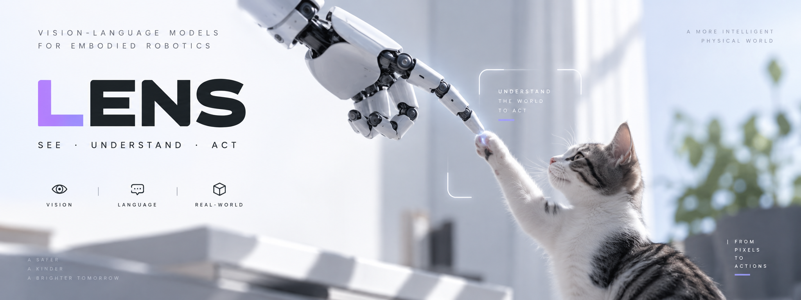
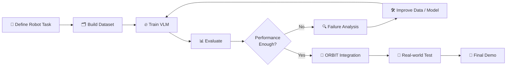

# 👁️ LENS

### Vision-Language Models for Embodied Robotics

**See. Understand. Act.**

VLM을 학습하고, ORBIT와 협업하여 실제 로봇에 탑재합니다.

 

---

## ✦ About LENS

LENS는 Vision-Language Model을 학습하고 실제 로봇 환경에 적용하는 것을 목표로 하는 스터디 프로젝트입니다.

단순히 VLM을 공부하는 데서 끝나지 않고,

**데이터 설계 → 모델 학습 → 평가 → ORBIT 연동 → 실제 로봇 탑재**

까지 전체 과정을 직접 경험합니다.

본 스터디에서 학습한 VLM은 ORBIT  
**Orchestrated Robot Behavior for Interactive Tasks**  
스터디와의 협업을 통해 실제 로봇 시스템에 적용할 예정입니다.

---

## 🤝 LENS × ORBIT

<table>
<tr>
<td width="50%" valign="top">

### 👁️ LENS
**See & Understand**

로봇의 시각 및 언어 이해를 담당합니다.

- Visual Perception
- Object Recognition
- Scene Understanding
- Spatial Reasoning
- Instruction Understanding
- Vision-Language Reasoning

</td>
<td width="50%" valign="top">

### 🛰️ ORBIT
**Plan & Act**

인식된 정보를 기반으로 로봇의 행동을 담당합니다.

- Robot Planning
- Task Execution
- Robot Control
- Human-Robot Interaction
- Real-world Action

</td>
</tr>
</table>

### Camera + Instruction → LENS → ORBIT → Robot Action

**Perception → Understanding → Planning → Action**

---

## 🎯 Learning Goals

### 01. Understand
VLM의 기본 구조와 동작 원리를 이해합니다.

Vision Encoder · LLM · Multimodal Projector · Transformer

### 02. Train
오픈소스 VLM을 직접 Fine-tuning합니다.

SFT · Instruction Tuning · LoRA · QLoRA · PEFT

### 03. Build
실제 로봇 Task에 필요한 Vision-Language Dataset을 구축합니다.

### 04. Evaluate
학습 모델의 성능과 Failure Case를 분석하고 개선합니다.

### 05. Deploy
ORBIT와 협업하여 학습한 VLM을 실제 로봇에 탑재합니다.

---

## 🗺️ Roadmap

| Step | Phase | Goal |
|:---:|---|---|
| 01 | Foundations | VLM 이해 및 연구 방향 설정 |
| 02 | Baseline | 학습 · 추론 파이프라인 구축 |
| 03 | Training | Robot-specific VLM 학습 |
| 04 | Integration | VLM과 ORBIT 시스템 연동 |
| 05 | Deployment | 실제 로봇 탑재 및 최종 데모 |

---

## 📅 16-Week Plan

| Week | Topic |
|:---:|---|
| 01–03 | VLM · ViT · LLM · Multimodal Architecture |
| 04–07 | Open-source VLM · Inference · SFT · LoRA |
| 08–11 | Robot Dataset 구축 · VLM Fine-tuning |
| 12–14 | Evaluation · Failure Analysis · ORBIT Integration |
| 15–16 | Real Robot Test · Optimization · Final Demo |

---

## 📦 Expected Outcomes

- VLM Study Notes & Paper Reviews
- VLM Fine-tuning Pipeline
- Robot-specific Vision-Language Dataset
- Fine-tuned VLM
- Model Evaluation Report
- LENS × ORBIT Integration
- Real-world Robot Demo

---

## 👥 Who Can Join?

- Python 기본 프로그래밍이 가능한 분
- Machine Learning / Deep Learning 기초 지식이 있는 분
- PyTorch 기반 코드를 읽고 실습할 수 있는 분
- VLM, Multimodal AI, Robotics에 관심이 있는 분
- 정기적인 스터디와 실험에 꾸준히 참여할 수 있는 분

VLM 및 Robotics 경험은 필수가 아닙니다.

**직접 모델을 학습하고 실제 로봇에 적용해보고 싶은 분을 환영합니다.**

---

## 🚀 Final Goal

### We don't just study VLMs.

# We put them on robots.

👁️ **LENS**  
See & Understand

↓

🛰️ **ORBIT**  
Plan & Act

↓

🤖 **ROBOT**

### From Pixels to Actions.

**Vision-Language Intelligence × Robot Intelligence = Embodied Intelligence**

